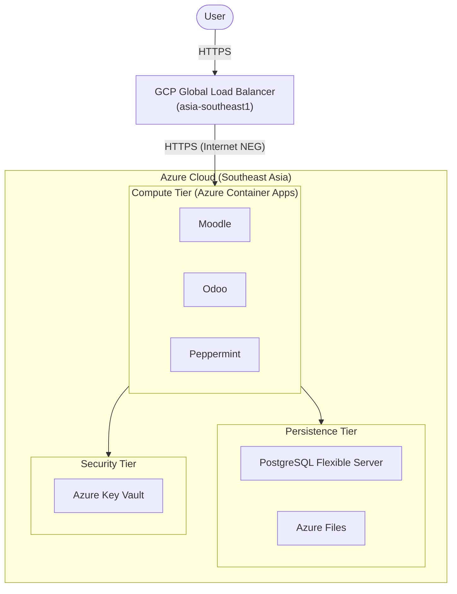

# ESMOS Healthcare — Infrastructure

This repository contains all Infrastructure-as-Code (IaC) for the ESMOS Healthcare platform. The infrastructure follows a **multi-cloud edge + single-cloud compute** pattern: Azure hosts the workloads, GCP provides the global edge layer.

---

## Structure

```
core-infra/
├── azure/    Azure core infrastructure — VNet, ACA, Postgres, Storage, Key Vault, ACR, OIDC
└── gcp/      GCP edge layer — Global Load Balancer, Internet NEGs
```

---

## Architecture



**Data residency**: All Azure resources are locked to `southeastasia` via Azure Policy. GCP resources deploy in `asia-southeast1` (Singapore) — same geographic region.

---

## Modules

| Directory | Cloud | Purpose |
| :--- | :--- | :--- |
| [azure/](./azure/README.md) | Azure | Core compute, networking, database, secrets, CI/CD identity |
| [gcp/](./gcp/README.md) | GCP | HTTPS termination, global edge routing |

---

## Deployment Order

1. **Azure first** — `core-infra/azure/` must be applied before GCP (GCP needs the ACA hostnames as origin targets)
2. **GCP second** — `core-infra/gcp/` provisions the edge layer pointing at live ACA URLs

See each subdirectory README for exact commands.

---

*Maintained by the ESMOS Infrastructure Team.*
