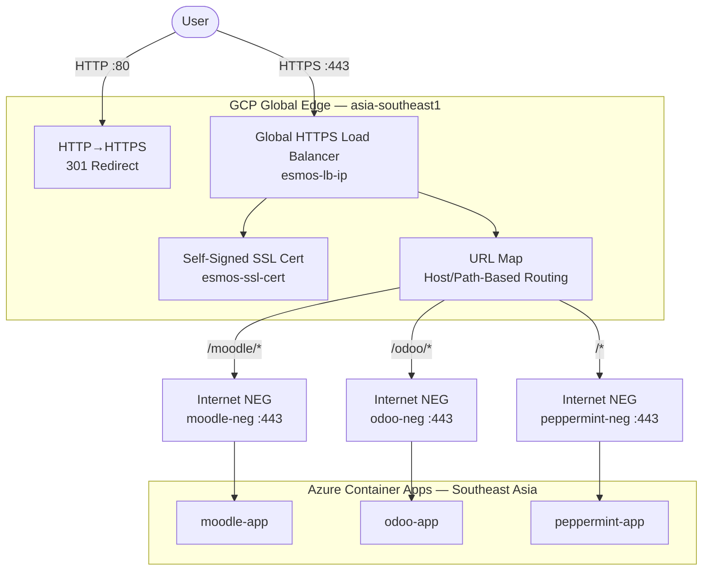

# ESMOS GCP Edge Layer

> **Global HTTPS Load Balancer in front of Azure Container Apps**

This module provisions a GCP-based edge layer that sits in front of the ESMOS Azure workloads. It provides global HTTPS termination and path-based routing to Moodle, Odoo, and Peppermint — without moving any compute out of Azure.

---

## Architecture



**Internet NEGs** allow GCP to proxy traffic to external FQDN backends (the Azure ACA hostnames) with no VPN or peering required.

---

## Resources Created

| Resource | Name | Purpose |
| :--- | :--- | :--- |
| `google_compute_global_address` | `esmos-lb-ip` | Static public IP for the LB |
| `google_compute_global_network_endpoint_group` | `moodle-neg`, `odoo-neg`, `peppermint-neg` | Internet NEGs pointing at ACA FQDNs |
| `google_compute_backend_service` | `moodle-backend`, `odoo-backend`, `peppermint-backend` | Backend services pointing to Azure origins |
| `google_compute_url_map` | `esmos-url-map` | Path-based routing (`/moodle/*`, `/odoo/*`, `/*`) |
| `google_compute_ssl_certificate` | `esmos-ssl-cert` | Self-signed TLS cert (no custom domain required) |
| `google_compute_target_https_proxy` | `esmos-https-proxy` | HTTPS proxy with SSL termination |
| `google_compute_global_forwarding_rule` | `esmos-https-forwarding` | Port 443 → HTTPS proxy |
| `google_compute_global_forwarding_rule` | `esmos-http-forwarding` | Port 80 → 301 redirect to HTTPS |

---

## Prerequisites

- [Terraform](https://www.terraform.io/downloads) >= 1.5.0
- [Google Cloud SDK](https://cloud.google.com/sdk/docs/install)
- GCP project with billing enabled (Azure for Students free credits work)
- `compute.googleapis.com` and `networksecurity.googleapis.com` APIs (auto-enabled by Terraform)

---

## Deployment

### 1. Authenticate

```bash
gcloud auth application-default login
```

### 2. Initialise

```bash
cd core-infra/gcp
terraform init
```

### 3. Apply

```bash
terraform apply -var="gcp_project_id=YOUR_GCP_PROJECT_ID"
```

### 4. Get URLs

```bash
terraform output
```

Expected output:
```
lb_ip_address   = "34.x.x.x"
moodle_url      = "https://34.x.x.x/moodle/"
odoo_url        = "https://34.x.x.x/odoo/"
peppermint_url  = "https://34.x.x.x/"
```

> **Note**: The LB takes 5–10 minutes after `apply` to become reachable globally. You will see a browser SSL warning for the self-signed cert — this is expected. Click through to verify routing works.

---

## Updating Origin Hostnames

If the ACA environment is redeployed and hostnames change, update `variables.tf`:

```hcl
variable "moodle_origin_fqdn"     { default = "moodle-app.<new-domain>.azurecontainerapps.io" }
variable "odoo_origin_fqdn"       { default = "odoo-app.<new-domain>.azurecontainerapps.io" }
variable "peppermint_origin_fqdn" { default = "peppermint-app.<new-domain>.azurecontainerapps.io" }
```

Then `terraform apply` again — only the NEG endpoints will be updated.

---

## Security Notes

- `X-Forwarded-Host` header is injected per backend so origin apps can reconstruct correct URLs
- HTTP traffic is hard-redirected (301) to HTTPS at the LB level — no plaintext traffic reaches origins
- **Azure for Students**: This architecture is optimized for low-cost student credits by using Standard tier LB with no per-policy monthly fees.
---

## Teardown

```bash
terraform destroy -var="gcp_project_id=YOUR_GCP_PROJECT_ID"
```

---

*Maintained by the ESMOS Infrastructure Team.*
